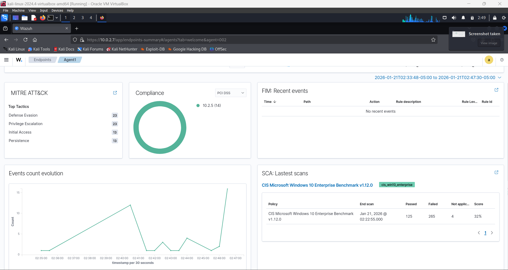

SIEM Lab with Wazuh

## 🚀 Project Overview
I built a functional Security Operations Center (SOC) home lab to simulate real-world cyber attacks and practice defensive monitoring. The goal was to deploy a SIEM (Wazuh), ingest logs from a victim machine, and detect brute-force attacks in real-time.

## 🛠️ Technologies Used
SIEM: Wazuh (Manager & Agent)
Attacker: Kali Linux (Hydra, Nmap)
Victim: Windows 10 Enterprise & Ubuntu Server
Virtualization:VirtualBox (NAT Network)

📸 Screenshots & Evidence

1. The Attack (Red Team)
Running a dictionary attack against SSH & RDP using Hydra to simulate an unauthorized access attempt.
[Hydra Attack Screenshot](Bruit-force_attack_Hydra_SSH.png)

### 2. The Detection (Blue Team)
*Wazuh dashboard correctly identifying the brute-force pattern (Rule ID 5710 & 5715).*

### 3. Compliance Auditing
*Using Wazuh SCA to audit the Windows machine against CIS Benchmarks.*
 score.png)

## 🧠 Key Takeaways
* Successfully configured agent-based log ingestion for SSH and System events.
* Learned to distinguish between "Authentication Failed" noise and actual "Successful Login" breaches.
* Gained hands-on experience with network isolation and port security (Port 22 vs RDP).
